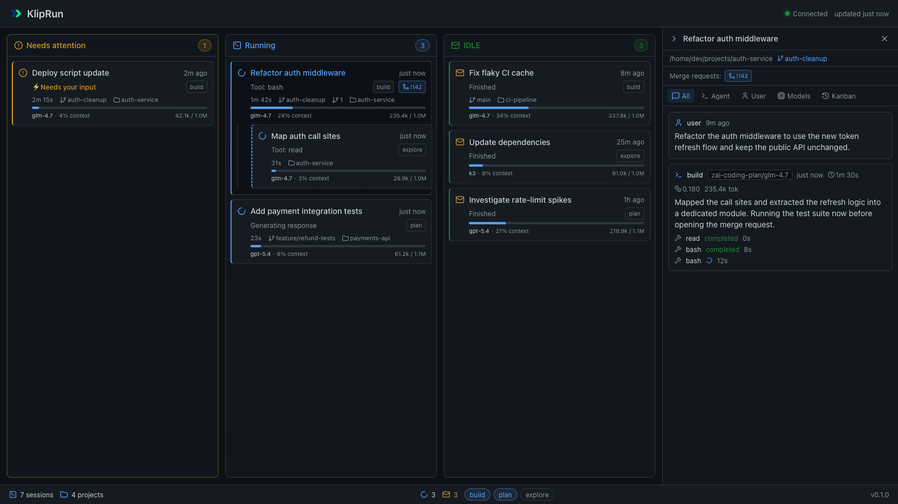
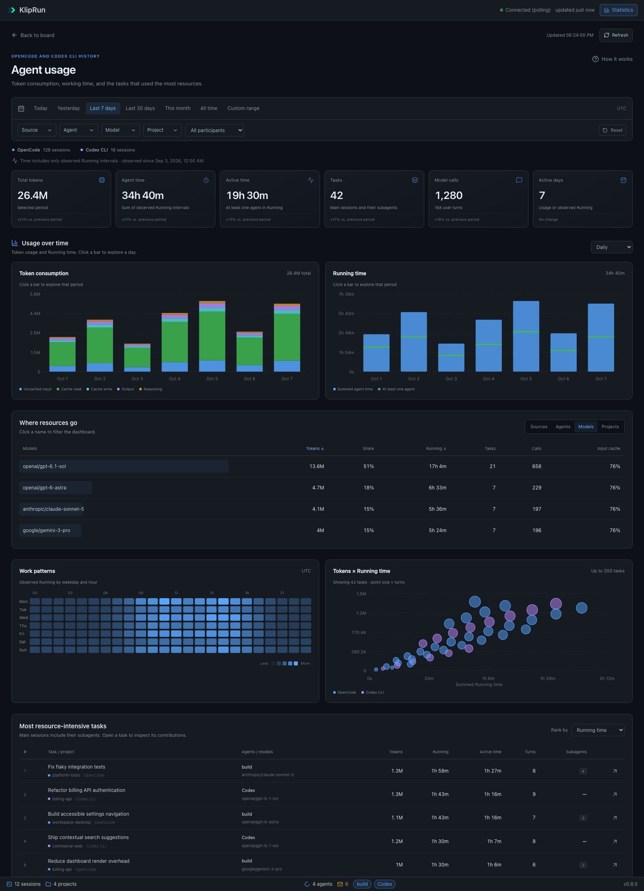

# KlipRun

[](https://bun.sh/)
[](https://www.typescriptlang.org/)
[](LICENSE)

**A local, read-only Kanban board for observing OpenCode and Codex CLI sessions.** KlipRun
shows active sessions, requests that need your attention, and idle sessions
whose OpenCode or Codex CLI TUI is still open. It never sends commands to either agent or
changes session state. Codex CLI cards share the same columns and carry a source badge.

KlipRun reads the OpenCode database directly (read-only) and reacts to file
changes — no background services to manage and no OpenCode API calls. Board
updates reach the browser in ~100 ms over Server-Sent Events.

## Preview

**Kanban board**



*Demo data: fictional OpenCode and Codex CLI sessions, projects and messages.*

**Usage dashboard**



*Demo data: fictional sessions, projects and usage.*

## Features

- Three columns: **Needs attention**, **Running**, and **IDLE**.
- Session cards with the title, agent, current stage (`Tool: bash`,
  `Generating response`, …), elapsed time, and child-agent count.
- **Context window bar** per card: model name, percent of the context window
  spent, and used/limit tokens (limits come from OpenCode's own model catalog;
  unknown providers show plain token counts).
- **Git branch chip**: the current branch of the session's repository
  (worktrees included).
- **Merge request chips**: MRs/PRs created by the session, extracted from the
  tool calls that created them — on the card and in the details panel.
- **Read/unread envelopes**: idle cards show a closed envelope until you open
  them; the status bar counts unread sessions.
- A details panel with messages (All / Agent / User), model usage and cost,
  and Kanban column history.
- Bottom status bar: session and project counts, running and unread counters,
  working agents, and the app version.
- Live updates over Server-Sent Events with ETag polling fallback.
- Monitoring of up to 20 directories with an OpenCode TUI currently open.
- A **Statistics** button opens usage history: date and source/agent/model/project
  filters, token breakdowns, observed Running time, activity heatmaps and task rankings.

## Usage statistics

Open **Statistics** in the upper-right corner, or visit `/stats`. The default
period is the last seven calendar days in the browser's timezone. Presets,
custom dates, multiple selections and ranking order are preserved in the URL.
Relative presets advance at midnight; custom dates stay fixed.

The dashboard imports the available OpenCode and Codex CLI history in a worker.
Archived sessions are included. OpenCode tasks combine their main session and
subagents, with each participant counted once. Codex subagents are excluded.
Import progresses in bounded pages/chunks and resumes from durable checkpoints;
unavailable sources and skipped records are shown separately.

Tokens represent recorded request usage, not the context bar on a live card.
Input, cache reads/writes, response and reasoning are normalized without double
counting. Source-recorded costs are shown with their coverage; they are not a
calculation of subscription charges. Usage without a confirmed date belongs only
in all-history totals, not in daily charts.

Work time means **only observed Running**. Sampling continues every three seconds
while KlipRun's server runs, even without an open browser. Attention, IDLE and
monitor downtime are excluded. Summed agent time counts parallel agents separately;
activity time counts overlapping intervals once. Historical intervals without
model/agent evidence remain in the unknown category. Missing observations remain
explicitly unavailable or partial; the dashboard does not reconstruct past Running.
Current partial calendar periods compare with the previous period through the
same local clock time; calendar months, including month-to-date, compare with
the preceding month.

Statistics refresh every 30 seconds. Ranking can use Running, tokens or turns;
opening a task shows participant/model contributions and a Running timeline.
Opening statistics preserves the board and does not mark idle cards read;
following a live task's link to its board details uses the normal read behavior.

## Requirements

- macOS (uses `ps`/`lsof` for TUI detection).
- [Bun](https://bun.sh/) 1.4 or newer.
- OpenCode CLI (`opencode`) and/or Codex CLI (`codex`) with sessions on disk.

## Install and run

Clone and run from the repository root:

```bash
bun install
bun run build     # build the web client
bun run start     # http://127.0.0.1:8792
```

Development:

```bash
bun run dev            # server with --watch on :8792
bun run dev:client     # Vite dev server on :5173, proxies /api → :8792
```

## How session cards are classified

- **Needs attention** — the TUI is waiting for a permission or an answer
  (confirmed via local Hermes heartbeat status, or a running `question` tool
  call in the open session history).
- **Running** — a fresh user turn (under 4 s) or an assistant turn still
  streaming (under 15 min without updates).
- **IDLE** — finished, inactive, or interrupted sessions left open in a TUI.
  An active response with no updates for over 15 minutes is treated as
  interrupted, not current work.

Only sessions mapped to a live TUI stay on the board: Hermes-matched sessions,
the latest session per unmatched TUI directory, and their transitive
sub-agent children. KlipRun detects TUI processes with `ps`/`lsof`, maps
windows to sessions through fresh heartbeat files under
`~/.cache/opencode-hermes/instances/*.json`, and falls back to the latest
session in a directory when Hermes is unavailable.

## Configuration

| Variable | Purpose | Default |
|---|---|---|
| `KLIPRUN_BUN_PORT` | Local web server port (`--port` flag wins) | `8792` |
| `KLIPRUN_BUN_DB` | OpenCode SQLite database (opened read-only) | `~/.local/share/opencode/opencode.db` |
| `KLIPRUN_BUN_HOME` | Directory for KlipRun local state (Kanban history and usage index) | `~/.kliprun_bun` |
| `KLIPRUN_BUN_MODELS` | Model catalog with context limits | `~/.cache/opencode/models.json` |
| `KLIPRUN_BUN_CODEX_HOME` | Codex metadata database and session journals (read-only) | `$CODEX_HOME` or `~/.codex` |

## Codex CLI

KlipRun reads the latest `state_*.sqlite` metadata database in read-only mode
and incrementally tails the journals of matched CLI sessions. It checks the
database schema before querying it. Missing or incompatible Codex storage
does not prevent OpenCode cards from loading.

Only interactive `codex` processes attached to a terminal are eligible;
app-server, `exec`, MCP servers and the desktop application are excluded.
An open rollout or session-writer file held by the CLI provides a direct match.
For shared app-server clients, the remaining CLI terminals in a directory can
match the set of CLI sessions whose writer files are held open by a live managed
Codex daemon. The numbers of unmatched terminals and loaded sessions must agree,
with the same live-session evidence for every terminal. This keeps multiple
windows and resumed sessions visible when older sessions remain in the database.
Files merely left on disk do not count.
Without either signal, the directory must contain exactly one non-archived
CLI session and one CLI terminal. CLI sessions
are identified by `source=cli`, or by `source=vscode` together with
`originator=codex-tui` for TUI clients using the shared app-server.
Ambiguous matches are omitted, with reasons available in
`GET /api/health` → `codex_diagnostics`. No match is inferred from a
`source=vscode` record alone. CLI versions which do not expose a matching
local session will therefore not appear.

- `task_started` marks work in progress; `task_complete` marks completion;
  `turn_aborted` marks interruption.
- A pending `request_user_input` call marks **Needs attention**. Permission
  dialogs cannot always be identified from local journals.
- Missing turn state, an unreadable journal, or a running turn with no events
  for 15 minutes produces **Status unknown** in IDLE, with a neutral icon and
  no successful-completion marker. Confirmed unanswered questions remain in
  Needs attention.
- Models, token counts and context limits come only from recorded data.
  The Models tab groups recorded Codex token usage by model; Codex's input
  includes cached tokens and its output includes reasoning tokens. The journal
  does not record cost, so the tab shows it as unavailable.
  Details contain at most 100 recent messages/tool entries; system prompts,
  reasoning and raw tool inputs/outputs are omitted. Codex subagent trees and
  MR extraction are not included in this version.
- Journal reads are bounded to the latest 4 MiB initially, then incremental;
  individual JSON records over 1 MiB are skipped. Unknown history is not
  reconstructed. File watching uses the existing SSE updates, with polling
  as fallback.

These tail limits apply to live cards/details. The separate statistics importer
streams full eligible journals in bounded chunks, without calling Codex APIs.

The API includes `source: "opencode" | "codex"` on cards and details.
Codex IDs are namespaced as `codex:<uuid>`; OpenCode IDs are unchanged.
Kanban history is stored only in KlipRun's own database and stops counting
an interval when its card leaves the board.

## API

| Endpoint | Description |
|---|---|
| `GET /api/health` | Liveness summary |
| `GET /api/board` | Board snapshot (ETag / 304) |
| `GET /api/stream` | SSE: `board-update` pushes + 30 s heartbeat |
| `GET /api/session/:id` | Messages, models, tools, MRs, Kanban history |
| `GET /api/stats` | Usage summary, comparisons, charts, facets and import status |
| `GET /api/stats/sessions` | Filtered task-tree ranking and pagination |
| `GET /api/stats/session/:id` | Historical task statistics and participant timeline |

Statistics filters: `from`/`to` are epoch milliseconds with an exclusive end;
`timezone` is an IANA zone; repeat `source`, `agent`, `model` and `project` for
multiple selections. `role=all|roots|children`, `granularity=day|week|month`.
Unknown agent/model evidence uses `__unknown__`. Rankings accept
`sort=running|tokens|turns`, `page` (starting at 1), and `limit` (1–50).
`period=month` selects month-to-date comparison with the preceding month;
the other presets compare the same number of calendar days.

## Development

```bash
bun run test                    # server, shared and statistics calendar/filter tests
bunx tsc -b                      # typecheck
bun run build                    # build the client
```

## Safety and privacy

KlipRun observes OpenCode and Codex CLI locally. Its web server binds
only to `127.0.0.1`; both agents' SQLite databases are opened read-only, and
their storage is never written. KlipRun does not create sessions, send prompts, answer
questions, approve permissions, or edit either agent's settings. Potential secrets
are filtered before session details are sent to the browser. The Kanban
history database stores only observed column intervals.
The separate `usage.sqlite3` index stores derived usage events, minimal session
metadata, interval attribution and import checkpoints. It stores no prompts,
response text or tool inputs/outputs. Both local databases live under
`KLIPRUN_BUN_HOME`; neither source database is modified.

## License

KlipRun is distributed under the [MIT License](LICENSE).
